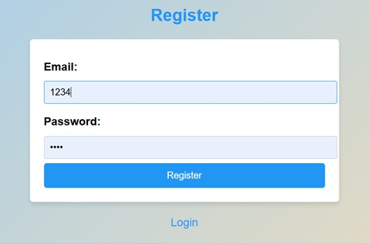
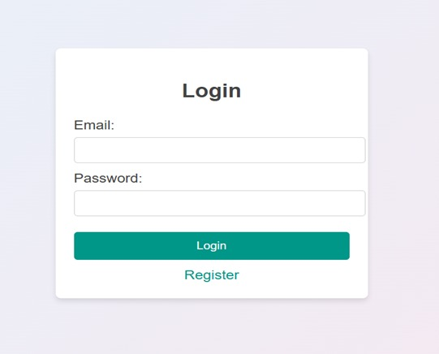
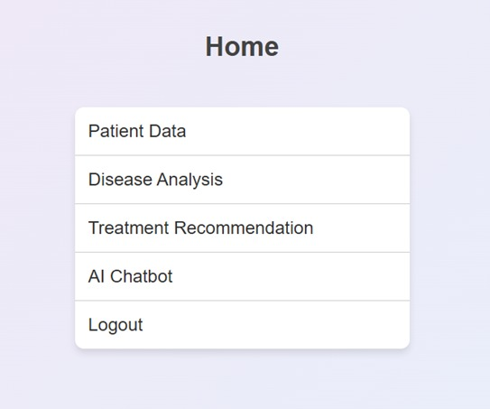
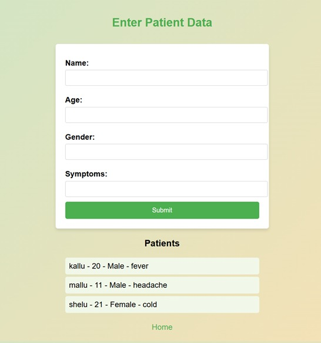
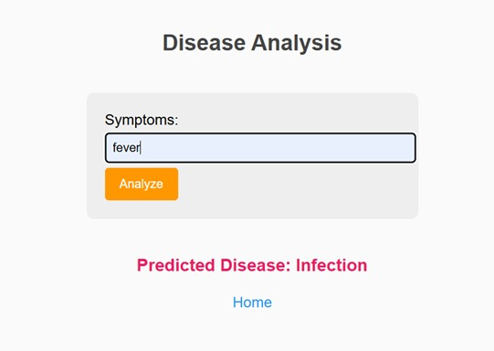
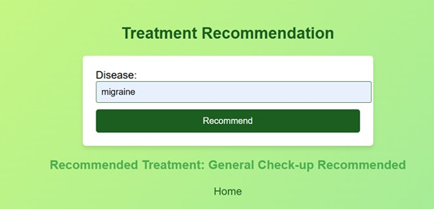
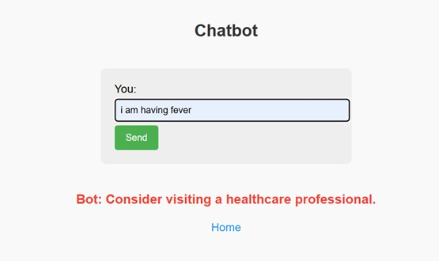

# Smart-HealthCare-An-AI-Powered-Patient-Management-and-Treatment-Recommendation-System


This is a Flask-based web application designed for disease prediction and patient data management using machine learning. Users can register, log in, input symptoms, and receive predictions for possible diseases. The app also includes a basic AI chatbot and treatment recommendation section.

## Features

- User authentication (register & login)
- Patient data entry and listing
- Disease prediction using a trained machine learning model
- Symptom-based analysis form
- AI Chatbot interface
- Treatment recommendation (placeholder)
- Clean, responsive HTML UI

## Technologies Used

- **Backend:** Python, Flask
- **Frontend:** HTML, CSS (inline)
- **ML Model:** Scikit-learn (serialized as `disease_model.pkl`)

## File Structure

```
disease-prediction-app/
├── app.py                     # Main Flask application
├── train_model.py             # Script to train and save the ML model
├── disease_model.pkl          # Trained model and vectorizer (Pickle file)
├── README.md                  # Project documentation
├── requirements.txt           # Python dependencies (you can generate this)
├── templates/                 # HTML templates
│   ├── login.html
│   ├── register.html
│   ├── home.html
│   ├── patient_data.html
│   ├── disease_analysis.html
│   ├── chatbot.html
├── static/                    # (Optional) CSS, JS, or images if separated
├── .gitignore                 # Git ignore file (optional)
└── tempCodeRunnerFile.py      # Temporary/dev file (optional to include)
```

## Getting Started

### Prerequisites

- Python 3.x
- pip

### Installation

1. Clone the repository or download the source code.
2. Install dependencies:

```bash
pip install flask scikit-learn
```

3. Run the application:

```bash
python app.py
```

4. Access it in your browser at `http://127.0.0.1:5000`

### Train Your Own Model (Optional)

```bash
python train_model.py
```

This script will generate a new `disease_model.pkl`.

## Screenshots








## License

This project is for educational purposes.
